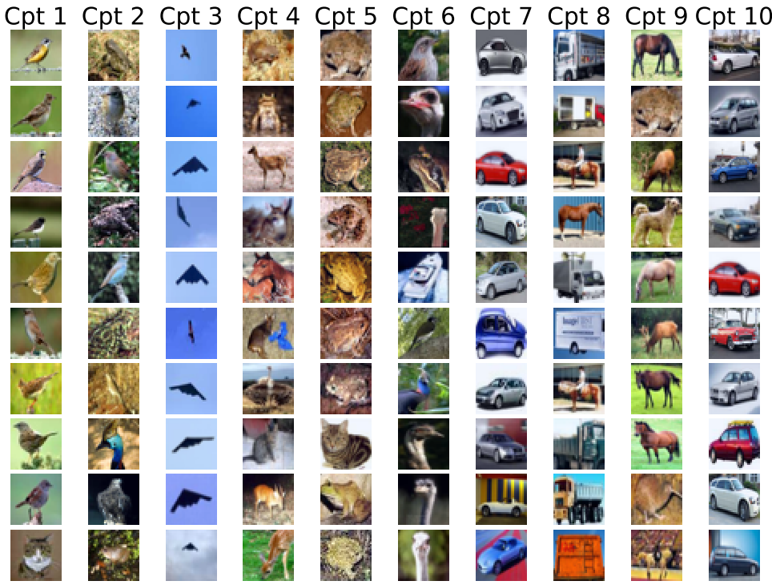

# A Framework for learning Ante-hoc Explainable Nodels via Concepts
This project is for the paper: "A Framework for Learning Ante-hoc Explainable Models via Concepts" (CVPR 2022) (https://arxiv.org/abs/2108.11761). 

Here is an overview of the work:


### Cifar-10 (original dataset)
The original work was implemented on Cifar-10.

To run on Cifar-10, go into `cifar10` dir and run the following script:

```shell script
python main_cifar.py --train --num_workers 4 --batch_size 32 --epochs 20
```


#### Visualization 



### SkinCon

I re-implemented the work on SkinCon (specifically Fitzpatrick17k) dataset and obtained **96%** acc in the 3-class classification (*non-neoplastic, benign* and *malignant*).

To run on SkinCon, go into `medical` dir and run the following script:

```shell script
python main_medical.py --train --dataset SkinCon --dataset_dir ../../../datasets/SkinCon --nclasses 3 --nconcepts 5 --num_workers 4 --batch_size 64 --epochs 100 --opt sgd --transform upsample
```

Note: the argument `--transform upsample` means using data augmentation to alleviate the data imbalance.

The concept grid visualization will be saved to `out` dir.

